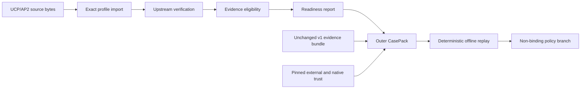

# MandateBound: Agentic Commerce Evidence Readiness

**Evidence readiness and deterministic dispute replay for agentic commerce.**

MandateBound captures, verifies, and preserves signed transaction evidence from checkout through order and refund review. It turns a fragmented UCP/AP2 record into an offline, reproducible case without claiming to decide legal liability.

> [!IMPORTANT]
> MandateBound is experimental decision-support software. It is not legal advice, legal adjudication, insurance, a claims service, a compliance certification, or a hosted production service. Every policy result keeps `legalEffect: "not-determined"`.

## The problem

Agentic commerce can authorize and execute a transaction across several systems. When the transaction is disputed, the relevant evidence may be split across signed HTTP exchanges, mandates, receipts, order events, refund events, changing keys, and local logs.

A later reviewer needs more than a successful signature check:

- Which exact protocol profile and bytes were verified?
- Did the evidence cover the expected lifecycle?
- Which authority and delegation assumptions were used?
- Was an artifact valid upstream but ineligible for the local review?
- Can the same case be replayed without querying live infrastructure?

MandateBound makes those questions explicit and machine-readable.

## What v1.2 adds

MandateBound v1.2 closes one gap left explicitly outside AP2 v0.2.0: preserving, assembling, and reviewing the four dispute artifacts as one independently verifiable evidence record.

- `assembleAp2DisputeEvidence` verifies materialized source responses offline.
- `resolveAp2DisputeEvidence` invokes caller-supplied retrieval adapters; the core defines no endpoint and performs no built-in network access.
- `packAp2DisputeEvidence` seals exact Mandates, Checkout versions, Receipts, caller pins, and imported revocation snapshots into a sensitive content-addressed Pack.
- `verifyAp2DisputeEvidencePack` requires an independently retained expected Pack digest, recomputes every stored digest, and reruns all AP2 gates; `renderAp2EvidenceTimelineHtml` recomputes that anchored verification before producing a metadata-only review timeline.
- Caller-owned verification plans keep historical keys, source pins, expected issuers, audiences, nonces, and time outside untrusted source responses.
- Direct and delegated Mandates, required autonomous constraints, the merchant-signed Checkout JWT, both Receipts, and cross-artifact bindings are checked under one immutable AP2 release pin.
- Duplicate exact copies retain all source references. Conflicting bytes never use last-response-wins selection.
- Resolver and timeline outputs contain digests, gates, coverage, and bounded issues, not raw tokens, snapshot bytes, or provider exception text.
- Revocation states are imported reports, not authenticated facts. Every result keeps the dispute outcome and legal effect not determined.

The exact boundary and Receipt-reference interpretation are documented in [`docs/V1_2.md`](docs/V1_2.md) and [ADR 0002](docs/adr/0002-ap2-dispute-resolver-boundary.md).

## What v1.1 provides

MandateBound v1.1 adds an evidence-import and case-readiness layer around the existing v1 evidence and policy engine:

- the exact **UCP 2026-04-08 REST + AP2 Mandates Extension / AP2 v0.2.0 evidence-import profile**
- full checkout-to-order/refund lifecycle capture for evidence supplied to the importer
- preservation of signed HTTP source bytes and exact compact AP2 token material where upstream verification depends on them
- `DelegationContext` for a digest-bound principal-to-delegate mandate, scope, validity window, and evidence references
- `ExternalTrustSnapshot` for pinned discovery material and source-checkpoint keys that can never auto-promote into native trust
- separate `upstreamValid` and `evidenceEligible` results
- evidence readiness states for `satisfied`, `missing`, `conflicting`, `unsupported`, `unknown`, and `not_applicable` requirements
- an outer `CasePack` that preserves the existing v1 `.albx.json` evidence bundle
- policy-pack validation, fixture testing, and deterministic rulebook change-impact reports
- a versioned conformance statement and narrow v1.1 fixture suite
- deterministic offline replay under the same policy, trust, schema, rulebook, engine, and source-profile inputs

The importer implements one exact evidence profile. It does not claim generic UCP compliance, generic AP2 compliance, payment-network certification, or interoperability with every UCP transport or extension.

## How the layers fit



The `CasePack` adds content-addressed source-evidence descriptors, deterministic mapping traces, source checkpoints, external discovery trust, delegation context, lifecycle state, and policy-relative coverage. It does not rewrite or silently upgrade the inner v1 bundle. The inner bundle remains independently verifiable under its v1 rules.

## Valid upstream is not eligible evidence

MandateBound records two different judgments for imported material:

| Field | Meaning |
| --- | --- |
| `upstreamValid` | The supplied source artifact passed the cryptographic, structural, hash-link, and profile checks required by the exact pinned upstream profile. |
| `evidenceEligible` | The artifact also meets MandateBound's pinned trust, role, timing, classification, supported-feature, and case-binding requirements for the requested review. |

Upstream validity is necessary but not sufficient for evidence eligibility. A correctly signed artifact can remain ineligible because its role is not trusted for the requested purpose, a constraint is unsupported, its case binding is incomplete, or the applicable snapshot does not authorize it.

Neither field proves that an assertion is true, that a person understood a transaction, that a loss occurred, or that any party is legally responsible.

## Evidence readiness

Readiness is reported per required evidence item, not as a misleading universal completeness score:

| Status | Meaning |
| --- | --- |
| `satisfied` | Eligible source evidence meets the named requirement. |
| `missing` | A requirement declared for the case was not met by supplied evidence. |
| `conflicting` | Source evidence for the requirement contains a material conflict. |
| `unsupported` | The source uses a feature the exact import profile cannot represent safely. |
| `unknown` | The bounded record cannot establish whether the requirement is complete. |
| `not_applicable` | The requirement does not apply to the selected case or lifecycle. |

The report is scoped to the exact import profile and requested lifecycle. It cannot prove that a party disclosed every relevant fact.

Artifact verification remains separate from coverage. Present but invalid or ineligible material is preserved through `upstreamValid`, `evidenceEligible`, and bounded issue codes. It is not counted as satisfying a requirement.

Every `CasePack` report keeps `globalCompleteness: "not-established"` and treats source truth as unknown. A signed source checkpoint can prove bounded inclusion against a declared source, window, sequence, and gap record. It cannot prove that the source reported every real-world event.

## Lifecycle capture

The v1.1 case layer can preserve evidence across:

1. checkout creation and updates
2. AP2 Checkout Mandate and Payment Mandate material
3. payment handoff and result evidence
4. order creation and status evidence
5. refund, return, cancellation, and price-adjustment evidence

Capture means that supplied source artifacts are preserved, linked, classified, and assessed. It does not mean MandateBound operates the checkout, initiates payment, monitors a merchant, or confirms settlement independently.

## Quick start

Requirements: Node.js 22.12 or newer.

```bash
git clone https://github.com/Oonyl/mandatebound.git
cd mandatebound
npm ci --ignore-scripts
npm run verify
npm run conformance
npm run demo
```

The demo uses synthetic identities and ephemeral test keys. It does not contact a network, move funds, submit a dispute, or write private keys to disk.

## CLI

The examples below use the installed `mandatebound` binary. From a source checkout, run `npm run build` and replace `mandatebound` with `node dist/cli.js`.

### CasePack workflow

```bash
mandatebound casepack build --input casepack-material.json
mandatebound casepack verify --input casepack-invocation.json
mandatebound casepack unpack --input casepack-invocation.json
mandatebound casepack diff --input casepack-diff.json
mandatebound case-report --input casepack-invocation.json --format json
mandatebound case-report --input casepack-invocation.json --format html > case-report.html
```

`casepack build` accepts unsealed outer `CasePack` material, directly or under a sole `casePack` property. The outer `casePackDigest` must be absent. The native v1 bundle and nested mapping traces, evidence envelopes, external trust, delegation context, coverage contract, and source checkpoints must already be sealed with the corresponding SDK helpers. Build seals only the outer `CasePack`.

`casepack verify`, `casepack unpack`, and `case-report` consume an exact object with `{casePack, anchors}`. The required anchor fields are `asOf`, `coveragePolicyDigest`, and `coverageContractDigest`. `externalTrustSnapshotDigest` and `rawEvidence` are optional when applicable.

Raw evidence appears only under `anchors.rawEvidence` and crosses the JSON CLI boundary as canonical standard base64:

```json
{
  "referenceId": "raw.checkout",
  "bytesBase64": "eyJzdGF0dXMiOiJvayJ9"
}
```

The CLI decodes that object to `{referenceId, bytes}` for verification. It rejects unknown fields and malformed or non-canonical base64. `casepack diff` consumes `{before, after}`, where each side is its own `{casePack, anchors}` invocation.

JSON commands return the standard `{ok, result}` envelope. HTML reporting writes a standalone document and omits raw evidence bodies.

### Policy and conformance

```bash
mandatebound policy validate --input policy-pack.json
mandatebound policy test --input policy-tests.json
mandatebound policy diff --input rulebook-diff.json
mandatebound conformance
```

Policy validation consumes `{policy, rulebook}`. Policy tests add `cases`. Rulebook diff consumes `{before, after}` with optional `cases` for behavioral impact.

`mandatebound conformance` prints the versioned bounded-capability statement. `npm run conformance` runs the repository fixture suite. Neither command grants protocol certification.

Existing native v1 CLI commands remain available after a build:

```bash
node dist/cli.js simulate --scenario all
node dist/cli.js decide case.json
node dist/cli.js verify case.albx.json
node dist/cli.js explain decision.json
node dist/cli.js serve --host 127.0.0.1 --port 8787
```

An unresolved policy result is a successful evaluation and exits with code `0`.

### AP2 Evidence Pack and dispute resolution

```bash
mandatebound ap2-dispute resolve --input ap2-dispute-input.json
mandatebound ap2-dispute pack --input ap2-pack-input.json > ap2-pack.json
mandatebound ap2-dispute verify --input ap2-pack.json --expected-pack-digest sha256:<64-hex-characters>
mandatebound ap2-dispute render --input ap2-pack.json --expected-pack-digest sha256:<64-hex-characters> --format html
```

The commands consume materialized sources and a separate caller-owned verification plan. They do not contact merchants, agents, providers, networks, or revocation services. Retain `result.packDigest` from `pack` in a separate trusted case record, then provide it to `verify` and `render`; the Pack cannot authenticate itself. The Pack contains raw sensitive evidence; the rendered timeline does not. A positive resolver or Pack verification exits with code `0`; an evidence gap returns the conflict exit class and a bounded `unresolved` result. See [`docs/V1_2.md`](docs/V1_2.md) for the exact contract.

## A dispute replay, in plain language

For a synthetic autonomous purchase:

1. A merchant returns signed UCP checkout terms.
2. A user authorizes bounded AP2 mandate material.
3. The agent completes the checkout and order lifecycle.
4. The importer preserves the exact signed exchanges and mandate representations.
5. The readiness report identifies verified evidence, gaps, rejected items, unsupported features, and contradictions.
6. The `CasePack` binds those records to the unchanged v1 evidence bundle and pinned trust inputs.
7. Offline replay applies the same data-only policy and emits the same policy branch from the same accepted bytes.

If a required payment receipt is missing, the case stays unresolved. If signed checkout bytes are mutated, upstream verification fails. If trusted evidence shows execution outside the mandate, the reference policy may select the operator branch. In every case, legal effect remains not determined.

## Native v1 policy

The bundled rulebook remains deliberately narrow:

| Verified condition | Policy result |
| --- | --- |
| A valid mandate covers the execution and required controls complied | Principal branch |
| A trustworthy operator receipt proves execution outside a valid mandate | Operator branch |
| Trusted, sufficient, non-conflicting causation evidence attributes the covered loss to the recorded model vendor, while the mandate is valid and operator controls complied | Model-vendor branch |
| Evidence is missing, invalid, stale, tampered, contradictory, or multi-causal | Unresolved, human review required |

A failed signature alone never selects the model-vendor branch. Missing evidence never defaults to a party. The engine produces a policy branch, not a legal judgment or amount owed.

## Capability matrix

Status describes this repository's implementation, not certification or production fitness.

| Capability | Status | Boundary |
| --- | --- | --- |
| Native v1 strict parsing, signatures, policy evaluation, bundle verification, and appeals | Implemented | Reference implementation with synthetic tests |
| UCP 2026-04-08 REST + AP2 Mandates Extension / AP2 v0.2.0 evidence import | Implemented | Exact profile only, not generic compliance |
| AP2 v0.2.0 Evidence Pack and dispute resolver | Implemented | Exact-byte `pack`, out-of-band digest anchored `verify`, recomputing metadata-only `render`, and caller-supplied retrieval; no claim outcome or authenticated revocation claim |
| Checkout-to-order/refund evidence capture, including returns, cancellations, and price adjustments | Implemented | Processes supplied evidence, not live transaction operations |
| `DelegationContext` and `ExternalTrustSnapshot` | Implemented | Digest-bound delegation plus discovery-only external trust, not proof of legal authority or identity |
| Readiness states and `upstreamValid` versus `evidenceEligible` | Implemented | Profile-scoped evidence assessment |
| Outer `CasePack` preserving the v1 bundle | Implemented | Does not alter v1 bundle semantics |
| Source checkpoints and policy-relative coverage contracts | Implemented | Bounded inclusion only, with global completeness not established |
| Deterministic offline replay | Implemented | Same accepted bytes and pins, same policy output |
| Policy-pack validate, test, and rulebook diff tools | Implemented | Closed native facts and non-binding policy branches |
| CasePack, policy, case-report, and conformance CLI | Implemented | Strict JSON input, explicit anchors, and raw evidence as base64 |
| Exact-profile conformance statement and fixtures | Implemented | Bounded evidence-profile claim only |
| Institution-specific trust and policy adoption | Experimental | Must be separately governed, tested, and contractually reviewed |
| Automated claim or dispute submission | Unsupported | Review artifacts only |
| Multi-party dollar waterfalls or contribution percentages | Unsupported | Deferred because the source protocols do not supply the necessary contractual terms |
| UCP over A2A or MCP | Deferred | No transport implementation or conformance claim |
| Visa TAP or x402 adapters | Unsupported | No evidence-import profile or conformance claim |
| Hosted, authenticated, multi-tenant production service | Unsupported | Local reference server only |

## Security, privacy, and determinism

MandateBound uses strict JSON parsing with duplicate-key rejection, bounded inputs, RFC 8785 canonical JSON for native artifacts, SHA-256 content addressing, and Ed25519 native evidence proofs. External source bytes keep the representation required by their pinned upstream profile. Parsed or reserialized JSON is never substituted where a source signature or digest covers raw bytes.

The evaluator performs no live DNS, DID, key, schema, policy, revocation, or clock lookup. Every decision receives an explicit `asOf` value and binds exact input digests.

Core artifacts prefer digests, classifications, and bounded metadata. Raw prompts, full model conversations, credentials, personal data, and unrelated production logs are excluded by default. A `CasePack` can bind references to sensitive evidence, so deployments still need access controls, retention rules, redaction lineage, and a lawful basis for processing.

See [Security](SECURITY.md), [Threat model](docs/THREAT_MODEL.md), [Privacy model](docs/PRIVACY_MODEL.md), and [Trust model](docs/TRUST_MODEL.md).

## Safety and limits

MandateBound does not:

- decide legal liability, contractual responsibility, causation, or damages
- prove real-world identity, human intent, legal authority, or truth
- underwrite insurance, custody funds, extend credit, or settle claims
- authenticate or harden a production deployment
- invent missing evidence or resolve contradictory and multi-causal evidence
- compute a multi-party dollar allocation or contribution waterfall
- certify UCP, AP2, payment-network, insurer, or regulator compliance
- guarantee evidence completeness or prevent a log tail from being withheld

Before real use, obtain independent legal, security, privacy, compliance, insurance, and operational review.

## Repository map

| Path | Purpose |
| --- | --- |
| [`schemas/v1`](schemas/v1) | Normative native artifact schemas |
| [`schemas/v1.1`](schemas/v1.1) | Additive `CasePack`, coverage, delegation, and external-trust schemas |
| [`schemas/v1.2`](schemas/v1.2) | AP2 dispute resolution, sensitive Evidence Pack, and Pack-verification schemas |
| [`conformance/v1.1`](conformance/v1.1) | Exact-profile capability declaration and conformance notes |
| [`conformance/v1.2`](conformance/v1.2) | AP2 dispute-integrity capability declaration and fixtures |
| [`rulebooks/v1`](rulebooks/v1) | Reference policy |
| [`src`](src) | Engine, evidence import, CasePack, API, CLI, and simulator source |
| [`test`](test) | Unit, property, security, API, CLI, and end-to-end tests |
| [`docs/V1_1.md`](docs/V1_1.md) | v1.1 profile, data model, lifecycle, and replay guide |
| [`docs/V1_2.md`](docs/V1_2.md) | v1.2 AP2 Evidence Pack, resolver, and timeline contract |
| [`docs/ARCHITECTURE.md`](docs/ARCHITECTURE.md) | Architecture and trust boundaries |
| [`docs/INTEROPERABILITY.md`](docs/INTEROPERABILITY.md) | External protocol boundary |
| [`docs/LEGAL_BOUNDARY.md`](docs/LEGAL_BOUNDARY.md) | Legal meaning and non-meaning |
| [`BRIEF.md`](BRIEF.md) | Product and policy brief |
| [`SUMMARY.md`](SUMMARY.md) | One-page project summary |
| [`CHANGELOG.md`](CHANGELOG.md) | Release notes |

## Development

```bash
npm ci --ignore-scripts
npm run typecheck
npm test
npm run test:coverage
npm run package:check
npm run verify
```

`npm run verify` is the release gate. It runs repository linting, dependency-license checks, strict type checking, coverage-enforced tests, and package-content verification.

Security reports should follow [SECURITY.md](SECURITY.md). Contributions should follow [CONTRIBUTING.md](CONTRIBUTING.md).

## Upstream specifications

The evidence-import profile is pinned to:

- [UCP 2026-04-08 specification](https://ucp.dev/2026-04-08/specification/overview/)
- [UCP AP2 Mandates Extension](https://ucp.dev/specification/ap2-mandates/)
- [AP2 v0.2.0 release](https://github.com/google-agentic-commerce/AP2/releases/tag/v0.2.0)
- [AP2 v0.2.0 immutable specification commit](https://github.com/google-agentic-commerce/AP2/blob/b4587ac1d055888a73b4b21750973cffba961793/docs/ap2/specification.md)
- [RFC 9421 HTTP Message Signatures](https://www.rfc-editor.org/rfc/rfc9421)
- [RFC 9530 Content-Digest](https://www.rfc-editor.org/rfc/rfc9530)

Those projects and specifications are upstream references. MandateBound is not affiliated with or endorsed by their authors.

## Project and license

MandateBound is published by Oonyl under the Apache License 2.0. See [LICENSE](LICENSE) and [NOTICE](NOTICE).

The license covers repository-authored software and documentation. It does not grant regulatory approval, insurance coverage, a legal opinion, certification, or rights to third-party standards and trademarks.
