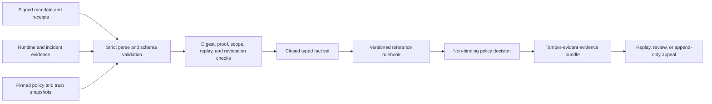

# MandateBound: Agent Loss Allocation Protocol

**Agent Loss Allocation Protocol.** An open-source AI agent liability policy engine for signed transaction evidence and non-binding loss-allocation recommendations.

> [!IMPORTANT]
> This is experimental decision-support software. It is not legal advice, legal adjudication, insurance, a claims service, a compliance certification, or agent-native credit.

## The problem

Autonomous agents can authenticate, receive mandates, call tools, and move money. The harder question arrives after something goes wrong: what did the principal authorize, what did the operator execute, what evidence survived, and which policy branch applies?

Most systems keep these facts in separate logs with different formats and changing trust assumptions. That makes post-transaction review slow, hard to reproduce, and easy to overstate.

MandateBound provides a neutral reference implementation for that missing evidence-to-policy bridge. It verifies a closed evidence bundle, derives typed facts, applies a versioned rulebook, and produces an explainable result whose exact inputs remain replayable.

## What it provides

- Normative JSON Schema 2020-12 artifacts for mandates, runtime events, receipts, incidents, causation attestations, policies, rulebooks, decisions, trust snapshots, bundles, and appeals
- Strict JSON parsing with duplicate-key rejection and bounded input limits
- RFC 8785 canonical JSON, SHA-256 content addressing, and Ed25519 evidence proofs
- Digest-pinned policy and trust snapshots with no live network resolution
- A deterministic policy engine with principal, operator, model-vendor, and unresolved branches
- A portable, tamper-evident `.albx.json` evidence bundle
- Immutable decisions and append-only appeals
- A local CLI, localhost HTTP API, simulator, and synthetic conformance tests
- Explicit separation between cryptographic facts, attributed assertions, policy conclusions, and legal judgment

## Quick start

Requirements: Node.js 22.12 or newer.

```bash
git clone https://github.com/Oonyl/mandatebound.git
cd mandatebound
npm ci --ignore-scripts
npm run verify
npm run demo
```

The demo creates ephemeral test keys in memory and runs synthetic scenarios. It does not contact a network, move funds, or write private keys to disk.

Example result:

```json
{
  "disposition": "allocated",
  "policyOutcome": "principal",
  "reasonCodes": ["MANDATE_VALID_IN_SCOPE"],
  "legalEffect": "not-determined"
}
```

## The reference rule

The bundled v1 rulebook is deliberately narrow:

| Verified condition | Policy recommendation |
| --- | --- |
| A valid mandate covers the execution and required controls complied | Principal branch |
| A trustworthy operator receipt proves execution outside a valid mandate | Operator branch |
| Trusted, sufficient, non-conflicting causation evidence attributes the covered loss to the recorded model vendor, while the mandate is valid and operator controls complied | Model-vendor branch |
| Evidence is missing, invalid, stale, tampered, contradictory, or multi-causal | Unresolved, human adjudication required |

A failed signature alone never selects the model-vendor branch. Missing evidence never defaults to a party.

## How it works



The evaluator does not fetch keys, schemas, policies, revocation lists, or current time. Every decision receives an explicit `asOf` value and binds the exact input digests. The same accepted bytes produce the same decision bytes.

## CLI

Build once before using the CLI directly:

```bash
npm run build
node dist/cli.js simulate --scenario all
node dist/cli.js decide case.json
node dist/cli.js verify case.albx.json
node dist/cli.js explain decision.json
node dist/cli.js serve --host 127.0.0.1 --port 8787
```

Machine-readable output goes to standard output. Diagnostics go to standard error. An unresolved decision is a successful evaluation and exits with code `0`.

## HTTP API

The reference server binds to `127.0.0.1` by default. It has no production authentication, TLS termination, tenant isolation, or distributed rate limiting.

| Method | Path | Purpose |
| --- | --- | --- |
| `POST` | `/v1/verify` | Verify a closed evidence bundle |
| `POST` | `/v1/evaluations` | Produce an immutable policy decision |
| `GET` | `/v1/decisions/{id}` | Retrieve a decision |
| `POST` | `/v1/appeals` | File an appeal |
| `POST` | `/v1/appeals/{id}/events` | Append an appeal event |
| `GET` | `/v1/appeals/{id}` | Read appeal state and lineage |
| `POST` | `/v1/simulations` | Run a synthetic scenario |
| `GET` | `/openapi.json` | Read the OpenAPI 3.1 document |
| `GET` | `/healthz` | Liveness check |
| `GET` | `/readyz` | Readiness check |

Malformed input returns privacy-safe [Problem Details](https://www.rfc-editor.org/rfc/rfc9457). An unresolved policy result is a valid `201` response, not a transport error.

## Evidence model

The engine handles eleven core artifact classes:

1. `MandateEnvelope`
2. `RuntimeEvent`
3. `ExecutionReceipt`
4. `IncidentReport`
5. `CausationAttestation`
6. `LiabilityPolicy`
7. `TrustSnapshot`
8. `EvidenceBundle`
9. `LiabilityDecision`
10. `AppealEvent`
11. `Rulebook`

Amounts use integer minor-unit strings. Timestamps use strict UTC RFC 3339 form. Unknown properties fail validation. Raw prompts and full transaction payloads are excluded by default.

See [Protocol](docs/PROTOCOL.md), [Rulebook](docs/RULEBOOK.md), and [Trust model](docs/TRUST_MODEL.md).

## Interoperability stance

The core is protocol-neutral. External formats are adapter inputs, never silent replacements for the native evidence model.

- AP2 artifacts must retain their exact compact serialization and be pinned to a specific profile and schema digest.
- SAFR-style checkpoints are represented through vendor-neutral runtime evidence. This project does not claim SAFR compliance or regulator endorsement.
- HTTP Message Signatures may protect transport, but they do not replace signed evidence artifacts.
- Verifiable Credential exports may carry assertions, but a valid proof does not establish that an assertion is true.

See [Interoperability](docs/INTEROPERABILITY.md) for the versioning and claims boundary.

## What makes this different

- **Evidence before allocation.** The engine refuses to allocate when required evidence is incomplete or contradictory.
- **Exact snapshots, not “latest.”** Policy, trust, schemas, rulebook, and engine version are bound by digest.
- **Causation stays attributed.** A signed causation attestation remains an assertion from that attestor.
- **History stays immutable.** Appeals append events and may reference a genuine superseding decision without rewriting the original.
- **No hidden resolution.** Evaluation performs no DNS, DID, key, policy, schema, or revocation lookup.
- **Legal effect is explicit.** Every result says `legalEffect: "not-determined"`.

## Safety and limits

This reference implementation does not:

- decide legal liability or contractual responsibility
- prove human intent, real-world identity, authority, or causation
- underwrite insurance, settle a claim, custody funds, or extend credit
- authenticate a production API deployment
- solve multi-party apportionment or jurisdiction-specific doctrine
- certify AP2, SAFR, payment-network, insurer, or regulator compliance
- guarantee evidence completeness or prevent a log tail from being withheld

Before production use, obtain independent legal, security, privacy, compliance, insurance, and operational review.

## Repository map

| Path | Purpose |
| --- | --- |
| [`schemas/v1`](schemas/v1) | Normative artifact schemas |
| [`rulebooks/v1`](rulebooks/v1) | Reference allocation policy |
| [`src`](src) | Engine, cryptography, bundle, API, CLI, and simulator source |
| [`test`](test) | Unit, property, security, API, and end-to-end tests |
| [`openapi`](openapi) | OpenAPI 3.1 contract |
| [`docs/ARCHITECTURE.md`](docs/ARCHITECTURE.md) | Architecture and trust boundaries |
| [`docs/THREAT_MODEL.md`](docs/THREAT_MODEL.md) | Threat model and fail-closed invariants |
| [`BRIEF.md`](BRIEF.md) | Product and policy brief |
| [`SUMMARY.md`](SUMMARY.md) | One-page project summary |

## Development

```bash
npm ci --ignore-scripts
npm run typecheck
npm test
npm run test:coverage
npm run package:check
npm run verify
```

`npm run verify` is the release gate. It runs repository linting, dependency-license checks, strict type checking, coverage-enforced tests, and package-content verification.

Security reports should follow [SECURITY.md](SECURITY.md). Contributions should follow [CONTRIBUTING.md](CONTRIBUTING.md).

## Provenance

Built under Oonyl's product direction, requirements, and evaluation, with AI-assisted implementation. The repository contains synthetic examples only and is not affiliated with or endorsed by any standards body, regulator, payment network, insurer, or model provider.

## License

Apache License 2.0. See [LICENSE](LICENSE).

The license covers the software and repository-authored documentation. It does not grant any regulatory approval, insurance coverage, legal opinion, or right to third-party standards and trademarks.
