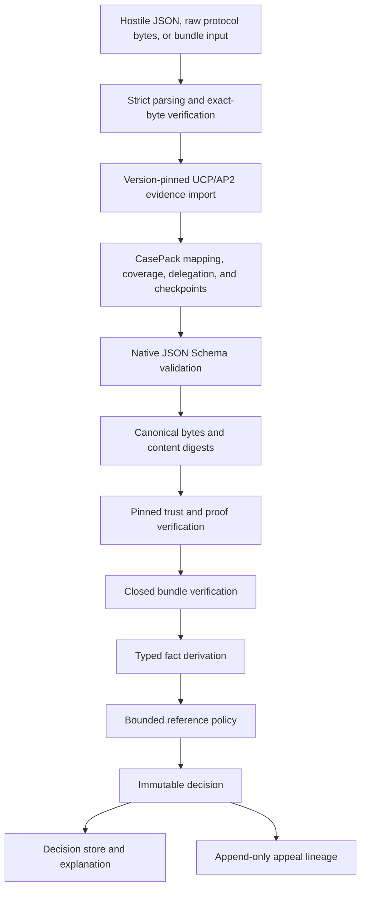

# Architecture

## Goal

The system imports exact protocol evidence, preserves it in a policy-relative CasePack, and converts the nested native evidence snapshot into a reproducible policy recommendation without making a network request or claiming legal effect.

## Components



### Domain and schemas

Domain types describe the accepted artifact classes. JSON Schema 2020-12 files are normative for interchange. Unknown properties are rejected.

### Strict parser

The parser rejects duplicate object keys before ordinary JSON parsing can discard them. It also enforces input size, nesting, member-count, string-length, number, Unicode, and byte-order-mark constraints.

### Canonical and cryptographic layer

Accepted I-JSON values are serialized into RFC 8785 canonical JSON. SHA-256 creates content identifiers. Ed25519 proofs bind artifact type, schema digest, purpose, key identifier, signing time, protected metadata, and payload. Actor identity remains inside the signed payload and is checked against the pinned key scope.

### Trust layer

An evaluation receives a trust snapshot and an exact pinned digest. The engine never trusts a key carried only by the artifact. Key roles, purposes, scopes, validity, and invalidation are checked at proof time, and proofs after the explicit evaluation cutoff are rejected.

### Bundle layer

A closed manifest lists every accepted artifact. Each entry is content-addressed. A deterministic Merkle tree and manifest digest produce a portable bundle root.

### Evidence-import and CasePack layer

The UCP/AP2 adapter verifies the exact supported REST and Mandates profile without modifying native v1 semantics. It preserves raw bodies, compact tokens, source digests, pinned external key snapshots, and verification outcomes.

`MandateBoundCasePack/v1` wraps an unchanged native `EvidenceBundle/v1` with protocol evidence envelopes, deterministic mapping traces, a delegation context, a caller-pinned coverage contract, optional external discovery trust, and optional signed source checkpoints. Its verifier reports integrity, bounded coverage, source truth, upstream validity, evidence eligibility, external trust, and delegation separately.

External trust remains discovery-only and cannot enter native `TrustSnapshot/v1` automatically. A successful CasePack check does not establish global completeness.

### Policy layer

The policy engine reads only enumerated typed facts. Its rule language is data-only and bounded. It cannot run scripts, use regular expressions, access arbitrary paths, fetch a resource, or read ambient time.

### Decision layer

A decision contains separate fields for:

- verified cryptographic and scope facts
- attributed assertions
- policy conclusions
- rejected and missing evidence
- matched rules and trace
- exact version and content digests
- non-binding legal-effect status

### Store and appeal layer

The local store is append-only and single-writer. An appeal adds events and can create a superseding decision. It never mutates the earlier decision.

## Dependency direction

```text
domain and strict parsing
  -> canonical, validation, crypto, trust
  -> bundle, policy, engine
  -> ucp-ap2, casepack, casepack-tools, report, conformance
  -> store, appeals
  -> API, CLI, simulator
```

Lower layers do not import transport or storage code.

## Determinism boundary

Every evaluation must supply:

- explicit `asOf` time
- exact case material; the engine deterministically creates a bundle or verifies that a supplied bundle matches the normalized case
- exact policy and rulebook
- exact trust snapshot and pin
- exact schema and engine versions

Locale, timezone, environment variables, working directory, object insertion order, and current network state must not affect decision bytes.

## Deployment boundary

The HTTP server is a local reference surface. A production deployment needs separate authentication, transport security, tenant authorization, key custody, durable replay state, quotas, observability, recovery, and independent security review.
