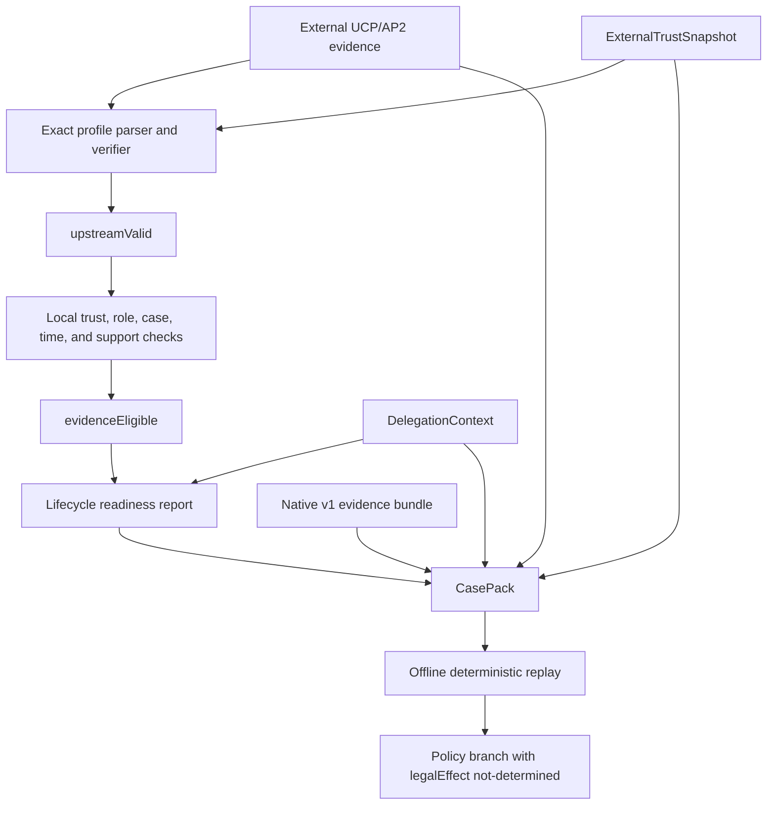

# MandateBound v1.1

## Purpose

MandateBound v1.1 adds evidence readiness and deterministic dispute replay for one exact agentic-commerce import target:

**UCP 2026-04-08 REST + AP2 Mandates Extension / AP2 v0.2.0 evidence-import profile**

The release preserves the native v1 evidence model and policy semantics. It introduces an outer case layer for source evidence, lifecycle state, external trust, delegation context, readiness, and replay.

This is an evidence-import profile, not a generic UCP or AP2 compliance claim.

## Design objectives

v1.1 is designed to:

1. preserve the source representation required to verify signed UCP/AP2 evidence
2. state the exact protocol, schema, and trust inputs used during import
3. distinguish source-profile validity from local evidence eligibility
4. expose `satisfied`, `missing`, `conflicting`, `unsupported`, `unknown`, and `not_applicable` evidence requirements
5. cover the supplied checkout-to-order/refund lifecycle
6. keep the existing v1 `.albx.json` bundle independently verifiable
7. replay an accepted case offline and deterministically
8. retain `legalEffect: "not-determined"` in every policy result

It is not designed to determine legal liability, automate dispute submission, compute damages, or operate as a hosted production service.

## Architecture



The import layer never silently converts an unsupported source feature into a native fact. Unsupported or lossy mappings fail closed and remain visible in readiness output.

## Exact source profile

### Pinned target

The implemented profile targets:

- [UCP 2026-04-08 REST](https://ucp.dev/2026-04-08/specification/overview/)
- [UCP AP2 Mandates Extension](https://ucp.dev/specification/ap2-mandates/)
- [AP2 v0.2.0](https://github.com/google-agentic-commerce/AP2/releases/tag/v0.2.0)

Other UCP dates, transports, extensions, AP2 releases, and default branches are different profiles. They are not accepted by implication.

### Representation preservation

The profile preserves exact source material when upstream verification depends on its representation:

- signed HTTP request and response bytes
- HTTP signature and content-digest fields
- compact JWT or SD-JWT material
- disclosures and key-binding material
- mandate and receipt hash relationships
- profile, version, and schema identifiers

The importer does not parse JSON and then treat a reserialization as the signed source body. Native MandateBound artifacts continue to use their own strict JSON and RFC 8785 canonicalization rules. The two representation domains remain separate.

### Offline boundary

Capture or import may be supplied with material obtained from an external system. Once a `CasePack` is sealed, verification and replay use the included or digest-pinned inputs. Replay does not resolve a current key, schema, profile, revocation list, policy, or clock value from the network.

## CasePack

`CasePack` is the v1.1 outer case format. It binds the material required to understand and replay an imported case:

- content-addressed source-evidence descriptors, references, lengths, and digests
- source protocol and profile identifiers
- deterministic import and mapping traces
- lifecycle and correlation metadata
- `DelegationContext`
- `ExternalTrustSnapshot`
- source checkpoints and a policy-relative evidence-coverage contract
- the native v1 evidence bundle
- the exact replay pins required by the policy engine

### Compatibility invariant

The native v1 evidence bundle is preserved as a closed object. The `CasePack` does not:

- rewrite v1 artifact bytes
- replace v1 schema validation
- change the v1 bundle root
- upgrade an old artifact silently
- merge external trust into the native v1 trust snapshot
- turn upstream assertions into established facts

A reviewer can verify the inner v1 bundle independently and then verify the outer case bindings.

## DelegationContext

`DelegationContext` binds a principal, delegate, mandate digest, scope digest, validity window, and supporting evidence references. It makes the delegation assumptions used during review explicit and keeps `legalEffect: "not-determined"`.

It is evidence context, not a legal conclusion. A valid context does not prove:

- the real-world identity of a party
- that a key controller had legal authority
- that a user understood or intended the action
- that every delegation outside the captured systems was disclosed
- that a mandate or contract is enforceable

If a required role or case binding is absent, ambiguous, or incompatible with the exact profile, the affected evidence is not promoted into an eligible policy fact.

## ExternalTrustSnapshot

`ExternalTrustSnapshot` freezes external discovery material and the public keys authorized only for source-checkpoint verification. It keeps external discovery trust separate from the native v1 `TrustSnapshot`.

The snapshot has `trustEffect: "discovery_only"` and `nativeTrustPromotion: "forbidden"`. Its discovery material is content-addressed, and its source-checkpoint keys have explicit sources and validity windows. It prevents a historical replay from silently adopting newer discovery bytes or checkpoint keys.

The snapshot records the trust decision used by the evaluator. It does not prove that the trust decision was legally or operationally correct.

## Protocol evidence and source checkpoints

Each `ProtocolEvidenceEnvelope` binds a source, event class, capture time, media type, raw-evidence descriptor, upstream-validity result, and deterministic mapping trace to native artifact references.

An optional `SourceCheckpoint` can commit a declared source window and sequence range to a Merkle root, previous checkpoint, explicit gaps, and Ed25519 proofs. Inclusion can establish that a named evidence leaf is committed by that checkpoint.

This remains a bounded claim:

- `sourceTruthStatus` stays `unknown`
- `globalCompleteness` stays `not-established`
- a checkpoint cannot prove that a source recorded every real-world event
- an omitted log tail or undisclosed source remains a governance and review problem

## Evidence-coverage contract

`EvidenceCoverageContract` defines the evidence obligations used for readiness. Each requirement names a declared source, event class, accepted media types, time window, minimum envelope count, and checkpoint requirement.

Coverage is explicitly `declared_sources_and_windows_only`. It is policy-relative and digest-bound to the native bundle root and coverage policy. Meeting it does not establish global completeness.

## Two-stage evidence decision

### `upstreamValid`

`upstreamValid` answers a narrow question: did this artifact pass the checks required by the exact pinned source profile?

Depending on artifact type, those checks can include:

- strict source structure and required fields
- supported profile and version
- raw-body content digest
- HTTP message signature
- compact token signature and disclosure integrity
- audience, nonce, time, and key binding
- mandate, checkout, payment, order, or receipt hash links

### `evidenceEligible`

`evidenceEligible` answers a different question: may the verified artifact contribute evidence to this MandateBound case under the pinned local inputs?

Eligibility additionally depends on:

- trusted signer role and scope
- delegation and transaction binding
- case and lifecycle correlation
- timing and invalidation rules
- evidence classification
- support for every material source constraint
- absence of a disqualifying contradiction
- requirements of the selected local policy

An artifact can be `upstreamValid: true` and `evidenceEligible: false`. It must never be promoted merely because its signature is valid.

Neither result establishes truth, causation, damages, legal responsibility, or an amount owed.

## Lifecycle capture

The profile organizes supplied evidence across the full review lifecycle:

| Phase | Evidence focus | Typical readiness question |
| --- | --- | --- |
| Checkout | Checkout creation, signed terms, updates, totals, and constraints | Are the exact terms and changes available and verified? |
| Mandate | Checkout and payment mandate material, disclosures, user and agent bindings | Does the mandate bind the intended checkout and transaction? |
| Payment | Payment handoff, authorization or result evidence, and hash relationships | Is the payment evidence present, linked, and eligible? |
| Order | Order creation, identifiers, state transitions, and fulfillment-related evidence | Can the order be correlated to the authorized checkout? |
| Post-order adjustment | Refund, return, cancellation, price-adjustment, result, and related order or payment references | Is the adjustment record correlated and eligible for this case? |

Lifecycle capture processes evidence presented to the importer. It does not call merchants, payment providers, or networks to discover missing records. It does not independently confirm settlement, fulfillment, refund receipt, or consumer harm.

## Evidence-readiness statuses

Each expected evidence requirement receives an explicit status:

| Status | Interpretation | Replay effect |
| --- | --- | --- |
| `satisfied` | Eligible source evidence meets the named requirement | The requirement may contribute to replay |
| `missing` | A requirement declared for the case was not met | The dependent branch cannot be established |
| `conflicting` | Source evidence for the requirement materially conflicts | Preserve the conflict and require human review |
| `unsupported` | A source feature cannot be represented safely by this profile | Fail closed |
| `unknown` | The bounded record cannot establish completeness | Do not infer satisfaction |
| `not_applicable` | The requirement does not apply to this case or lifecycle | Exclude it from the applicable requirement set |

Readiness is scoped to the named profile, lifecycle, coverage contract, policy, and supplied case. MandateBound deliberately does not emit a universal completeness percentage.

Artifact-level verification remains separate. Present material that fails source verification or local eligibility is preserved through `upstreamValid`, `evidenceEligible`, and bounded issue codes. It is not counted as satisfying a requirement.

## Deterministic offline replay

A replay uses:

- the same accepted source bytes
- the same `ExternalTrustSnapshot`
- the same `DelegationContext`
- the same native evidence bundle
- the same native trust snapshot
- the same policy, schema, and rulebook digests
- the same engine semantics version
- the same explicit `asOf` value

No live resolver selects a newer input. If the accepted bytes and all pins are the same, the replayed policy result is the same.

Later evidence or an updated trust position belongs in a new case version or an append-only appeal. It must not rewrite the historical result.

## Policy-pack and conformance tools

The v1.1 policy tooling provides:

- policy and exact-rulebook reference validation
- closed-fact fixture evaluation with expected outcomes and reason codes
- deterministic rule-level digest differences
- case-level behavior changes between two valid rulebooks

The conformance surface publishes a versioned capability statement. `mandatebound conformance` prints that statement, while `npm run conformance` runs the repository fixtures. The statement identifies supported, deferred, and unsupported capabilities under the exact evidence-import profile. Passing the fixtures is a repository test result, not a general protocol certification.

## CLI boundary

The installed binary exposes the v1.1 workflow directly:

```bash
mandatebound casepack build --input casepack-material.json
mandatebound casepack verify --input casepack-invocation.json
mandatebound casepack unpack --input casepack-invocation.json
mandatebound casepack diff --input casepack-diff.json
mandatebound policy validate --input policy-pack.json
mandatebound policy test --input policy-tests.json
mandatebound policy diff --input rulebook-diff.json
mandatebound case-report --input casepack-invocation.json --format json
mandatebound case-report --input casepack-invocation.json --format html
mandatebound conformance
```

Use `-` instead of a path to read JSON from standard input.

### Build

`casepack build` seals the outer `MandateBoundCasePack/v1`. It accepts the unsealed outer material directly or under a sole `casePack` property, and rejects input that already contains `casePackDigest`.

Build does not seal nested material on the caller's behalf. Before calling it, use the SDK helpers to seal:

- the native v1 evidence bundle
- deterministic mapping traces
- protocol evidence envelopes
- the optional external trust snapshot
- delegation context
- evidence-coverage contract
- source checkpoints

The corresponding constructors are `createEvidenceBundle`, `sealDeterministicMappingTrace`, `sealProtocolEvidenceEnvelope`, `sealExternalTrustSnapshot`, `sealDelegationContext`, `sealEvidenceCoverageContract`, and `sealSourceCheckpoint`.

The command returns a JSON `{ok, result}` envelope whose `result` is the sealed outer `CasePack`.

### Verify, unpack, and report

`casepack verify`, `casepack unpack`, and `case-report` require an exact two-property input:

```text
{ casePack, anchors }
```

`anchors` requires:

- `asOf`
- `coveragePolicyDigest`
- `coverageContractDigest`

It may also contain `externalTrustSnapshotDigest` and `rawEvidence`.

Raw evidence is represented in JSON as:

```json
{
  "referenceId": "raw.checkout",
  "bytesBase64": "eyJzdGF0dXMiOiJvayJ9"
}
```

The CLI accepts canonical standard base64 in `bytesBase64`, decodes it to `{referenceId, bytes}`, and rejects unknown fields or malformed encodings. It does not accept a JSON byte array or a `bytes` field at the CLI boundary.

`casepack unpack` verifies before returning separated contents. `case-report --format json` returns the standard JSON envelope. `case-report --format html` writes a standalone deterministic HTML document that omits raw evidence bodies.

`casepack diff` requires `{before, after}`. Each side must be its own `{casePack, anchors}` invocation so both cases are verified under explicit pins before comparison.

### Policy inputs

`policy validate` accepts `{policy, rulebook}`. `policy test` accepts `{policy, rulebook, cases}`. `policy diff` accepts `{before, after}` with optional `cases` for case-level behavior changes.

## Policy and legal boundary

The native reference rulebook still selects one of four outcomes:

- principal branch
- operator branch
- model-vendor branch
- unresolved

These names describe reference policy branches. They do not declare a legally liable party.

Every machine decision retains:

```json
{
  "legalEffect": "not-determined"
}
```

The engine does not determine governing law, legal authority, enforceability, negligence, causation in law, damages, insurance coverage, contribution, or evidentiary admissibility.

## Privacy boundary

Source commerce records may contain personal, payment, commercial, or confidential information. A production integration must define:

- the lawful basis and purpose for capture
- access and tenant boundaries
- retention, deletion, and legal-hold rules
- redaction and derivative lineage
- encryption and key custody
- disclosure and dispute procedures
- cross-border processing controls

Prefer digests and bounded metadata when raw source evidence is not required. Never place credentials, private keys, full prompts, unrelated logs, or payment credentials in a case.

A redacted artifact is a new derivative with a new digest. It must not retain a proof as though its bytes were unchanged.

## Failure behavior

The v1.1 profile fails closed:

- unknown material constraints are unsupported
- duplicate or ambiguous artifacts are rejected or surfaced as contradictions
- source mutation breaks the applicable signature or digest relationship
- missing evidence does not default to a party
- a valid signature does not override a role, timing, case-binding, or trust failure
- contradictory or multi-causal evidence remains unresolved
- a network failure cannot change offline replay because replay performs no lookup

Stable reason codes should be used for automation. Sensitive input bodies should not be echoed in diagnostics.

## Capability and deferral matrix

| Capability | v1.1 state | Reason |
| --- | --- | --- |
| Exact UCP/AP2 evidence-import profile | Implemented | Narrow, version-pinned target |
| Checkout-to-order/refund evidence capture, including returns, cancellations, and price adjustments | Implemented | Makes lifecycle gaps explicit |
| `CasePack`, readiness, external trust, and delegation context | Implemented | Adds a case layer without breaking v1 |
| Source checkpoints and evidence-coverage contracts | Implemented | Bounded declared-source coverage, not global completeness or source truth |
| Offline deterministic policy replay | Implemented | Reuses the established v1 engine boundary |
| Policy-pack validate, test, and rulebook diff tools | Implemented | Closed native facts and non-binding policy branches |
| CasePack, policy, case-report, and conformance CLI | Implemented | Strict JSON input, explicit anchors, and raw evidence as base64 |
| Exact-profile conformance statement and fixtures | Implemented | Bounded evidence-profile claim, not certification |
| Institution-specific trust and policy adoption | Experimental | Requires separate governance and contractual review |
| Multi-party dollar waterfall | Unsupported | AP2 and UCP do not supply the caps, priorities, exclusions, contribution rules, valuation, and governing terms required for a defensible amount |
| UCP over A2A or MCP | Deferred | Each transport needs its own exact profile and conformance fixtures |
| Visa TAP or x402 adapters | Unsupported | No evidence-import profile or conformance claim |
| Automated dispute submission | Unsupported | Evidence review stays separate from external claims actions |
| Hosted multi-tenant service | Unsupported | The repository does not provide production authentication, isolation, TLS termination, or distributed operations |

### Why the dollar waterfall is deferred

Turning a policy branch into quantified party contributions would require signed contractual terms for caps, deductibles, limits, exclusions, priority, subrogation, allocation basis, loss valuation, and governing-law exceptions. Those inputs are not established by the implemented UCP/AP2 profile.

Inventing percentages would create false precision and weaken the v1 rule that contradictory or multi-causal evidence stays unresolved. A future experimental simulator may accept explicit, signed contractual inputs and show an assumption-bound scenario, but it must still use `legalEffect: "not-determined"` and must never label a result as an amount legally owed.

## Compatibility

v1 evidence bundles and decisions remain valid under their original schemas and pins. A v1.1 `CasePack` can wrap a v1 bundle without altering it. Consumers that only understand the v1 bundle can continue to verify the inner object and ignore the outer layer.

Source-profile changes require a new, named import profile. They are not silently applied to historical cases.

## Release QA

The release gate remains:

```bash
npm ci --ignore-scripts
npm run verify
npm run conformance
```

The exact passing command output must be recorded during release QA. Documentation does not claim that a local command passed unless its release check completed successfully on the candidate bytes.

Passing repository tests demonstrates the behavior of the tested reference implementation. It does not provide a compliance certification, legal opinion, or production security assessment.

## Related documentation

- [Architecture](ARCHITECTURE.md)
- [Interoperability](INTEROPERABILITY.md)
- [Protocol](PROTOCOL.md)
- [Rulebook](RULEBOOK.md)
- [Trust model](TRUST_MODEL.md)
- [Privacy model](PRIVACY_MODEL.md)
- [Legal boundary](LEGAL_BOUNDARY.md)
- [Threat model](THREAT_MODEL.md)
